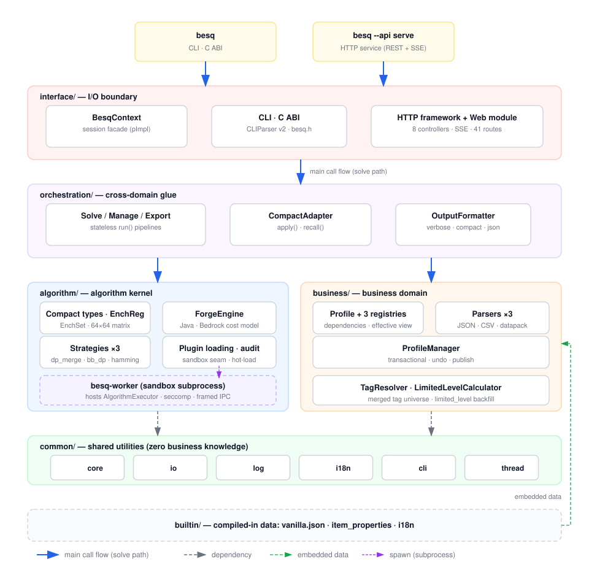

# BestEnchSeq-Core

[](https://en.cppreference.com/w/cpp/20)
[](LICENSE)
[](#build-from-source)

> **English** | [简体中文](README.md)

BestEnchSeq-Core is a **Minecraft enchanting-order planner**: given a desired final state (`--target`) and a starting state (`--source` or an inventory), it searches for the **cost-optimal anvil forging sequence** of enchanted books and prints a step-by-step plan. It models the full constraint set — prior work penalty, enchantment conflicts, equipment applicability (tags), Java/Bedrock platform differences, and the Too Expensive (level 39) ceiling.

The project is **data-driven**: built-in vanilla data tables, plus custom JSON/CSV sheets, official Minecraft datapacks, and modded enchantments. The algorithm kernel is **pluggable** (built-in strategies + runtime plugin hot-loading + audit/sandbox isolation). Pure C++20 with the standard library only — **zero third-party dependencies** (HTTP, JSON, i18n and concurrency components are all self-built).

## ✨ Features

- **Optimal forging sequences**: cost-optimal book order (exact + approximate strategies)
- **Data-driven**: vanilla JSON / CSV / official datapack (`pack.mcmeta`) / custom mod sheets
- **Profile as a first-class citizen**: dependency graph (topological resolution + cycle detection), effective-view merging, transactional mutation (undo), versioned publish (`--publish`)
- **Pluggable algorithms**: built-in `dp_merge` / `bb_dp` / `hamming`; hot-loaded plugins `astar` / `dfs` / `idastar` / `diff_first` / `penalty_balance`
- **Sandbox isolation** (`BESQ_SANDBOX=1`): third-party plugins run inside a `besq-worker` subprocess; the parent never `dlopen`s; static ELF/PE audit (W^X, dangerous symbols)
- **Asynchronous execution**: pause/resume/cancel + streaming progress + binary checkpoints (resume from pause)
- **Three interfaces**: CLI (`besq`), C ABI (`include/besq/besq.h`), and a local Web GUI (`besq-gui`, REST + SSE)
- **i18n**: built-in en_US / zh_CN; `--lang` > `BESQ_LANG` > system locale
- **Zero third-party dependencies in the C++ core**: self-built HTTP server, JSON DOM, logger, i18n, concurrent queues

## 🚀 Quick Start

**Requirements**: a C++20 compiler (Clang 15+ or MSVC), CMake 3.25+, Ninja. The project uses C++20 unconditionally (concepts, `if constexpr`, `std::jthread`, atomic `wait`/`notify`) — C++17 and earlier are not supported.

### Build from Source

```bash
# Configure + build (Clang + Ninja; MSVC works on Windows too)
cmake -S . -B build -G Ninja -DCMAKE_BUILD_TYPE=Release
cmake --build build

# Solve: --target is the desired final state, --source the starting point
./build/bin/besq --target "diamond_sword[sharpness=5,knockback=2]" --source "sharpness=2"

# Goal already met: --source >= --target prints a 0-step plan ("goal already met")
./build/bin/besq --target "diamond_sword[sharpness=5]" --source "sharpness=5"

# Inventory mode: --input takes a self-contained JSON task (target/items/algorithm/profile)
./build/bin/besq --input task.json
./build/bin/besq --input -   # read from stdin

# Other languages / JSON output
./build/bin/besq --lang en_US --target "diamond_sword[sharpness=5]" --source "sharpness=2"
./build/bin/besq --format json --target "diamond_sword[sharpness=5]" --source "sharpness=2"
```

### External Algorithm Plugins

```bash
# Build the host project first, then build plugins against the host build tree
# (compiler AND build type must match the host, otherwise loading fails at runtime)
cmake -S plugins -B build/plugins -DCMAKE_BUILD_TYPE=Release \
  -DCMAKE_C_COMPILER=clang -DCMAKE_CXX_COMPILER=clang++ \
  -DCMAKE_PREFIX_PATH=$PWD/build
cmake --build build/plugins

# Load plugins and list all available algorithms
./build/bin/besq --algo-dir build/plugins --list-algorithms

# Use a plugin algorithm (astar / dfs / idastar / diff_first / penalty_balance)
./build/bin/besq --algo-dir build/plugins --algorithm astar \
  --target "diamond_sword[sharpness=5,looting=3,unbreaking=3]" --source "sharpness=3"

# Sandbox mode: plugins run isolated inside a besq-worker subprocess
BESQ_SANDBOX=1 ./build/bin/besq --algo-dir build/plugins --algorithm astar \
  --target "diamond_sword[sharpness=5]" --source "sharpness=2"
```

### Profiles / Data

```bash
# Select a profile (dependencies resolve automatically; the root key is builtin:vanilla)
./build/bin/besq --profile builtin:vanilla --target "diamond_sword[sharpness=5]" --source "sharpness=2"
./build/bin/besq --profile-dir data/tests/profiles --profile modded_sword \
  --target "diamond_sword[sharpness=5]" --source "sharpness=2"

# Publish a profile: flatten the effective view into a self-contained JSON
./build/bin/besq --publish builtin:vanilla --publish-version 1.0 --publish-tag stable --output vanilla.json

# Manage profile data (import / edit / export)
./build/bin/besq --import mods/myenchant.json
./build/bin/besq --edit "ench:mod,sharpness,max_level=10"
./build/bin/besq --export out.json
```

Run `besq --help` for the complete, grouped CLI reference.

## 🖥️ Web GUI (`besq-gui`)

A player-facing local Web GUI over the same core (REST API + SSE event streams). Build with `BESQ_BUILD_GUI=ON`.

```bash
# Build
cmake -S . -B build -G Ninja -DCMAKE_BUILD_TYPE=Release -DBESQ_BUILD_GUI=ON
cmake --build build --target besq-gui

# Run (default 127.0.0.1 + OS-assigned port; --browser opens the browser)
./build/bin/besq-gui --browser

# Dev mode: SPA hot-reload from disk
BESQ_GUI_PORT=8765 ./build/bin/besq-gui --frontend-dir gui/frontend
```

| Controller | Endpoints (excerpt) |
|---|---|
| Health | `GET /health` |
| Status | `GET /api/status` |
| Settings | `GET/PATCH /api/settings` (persisted to `config.json`) |
| Profiles | `/api/profiles` CRUD + activate/fork/merge/publish/rename + `{key}/enchantables/{item}` |
| Algorithm | `GET /api/algorithms[/{name}]`, `POST .../load\|unload` |
| Calculator | `POST /api/tasks`, `GET/DELETE /api/tasks/{id}`, `POST .../pause\|resume` |
| Fs | `GET /api/fs/list` (directory picker) |
| History | `GET /api/history` (solve history, `offset`/`limit`/`after_seq` paging) |

SSE event stream: `GET /api/tasks/{id}/events` (`progress` / `diag` / `completed` / `failed` frames, 15s heartbeat); static assets under `/public`.

## 🧠 Algorithm Strategies

| Strategy | Type | Optimality | Scale | Origin | Mechanism |
|---|---|---|---|---|---|
| `dp_merge` | Exact | Yes | ≤ 20 | Built-in (direct mode default) | Recursive partition DP + (EnchSet, PPN) Pareto buckets; checkpoint-resumable |
| `bb_dp` | Exact | Yes | ≤ 24 | Built-in | Branch & bound + level-wise bottom-up DP, lazy StepTree |
| `hamming` | Approx | No | Large | Built-in (inventory mode default) | Popcount-balanced merge tree, O(n log n) |
| `astar` | Exact | Yes | ≤ 9 | Plugin | Admissible heuristic + priority queue |
| `dfs` | Exact | Yes | ≤ 8 | Plugin | Branch & bound + hash memoization |
| `idastar` | Exact | Yes | ≤ 10 | Plugin | Iterative deepening + transposition table |
| `diff_first` | Approx | No | Any | Plugin | Cheapest pair per PPN layer |
| `penalty_balance` | Approx | No | Any | Plugin | Merge closest penalty pairs |

New algorithms only need to implement `IAlgorithm::execute()` to gain thread management, pause/cancel, and progress reporting.

## 🏗️ Architecture

Four-domain one-way layering on top of shared utilities. Three artifacts (`besq` / `besq-gui` / `besq-worker`) share the same core:



```
CLI / GUI → BesqContext (session facade)
  → Orchestration pipelines (Solve / Manage / Export)
  → CompactAdapter::apply() (business → compact types, EnchReg pruning)
  → IExecutor (AlgorithmExecutor | SandboxedExecutor) → IAlgorithm
  → CompactAdapter::recall() (restore IDs + build solutions) → OutputFormatter
```

Key design decisions:

- **Two-layer type system**: fat business objects (NSID string keys) ↔ compact algorithm value types (`Ench` 2B / `EnchSet` 88B / 64×64 conflict matrix O(1)), bridged solely by `CompactAdapter`
- **Sandbox at the executor seam**: plugins reach the caller as `IExecutor` either way; cross-process pause/checkpoint semantics match in-process ones
- **Profile as a first-class citizen**: pipelines accept `Profile`/`ProfileManager` only, never raw registries; applicability = `supported_items ∩ tags_of(item)`
- **Stateless pipelines**: `struct XxxPipeline { static run(...) }` — no registration, no virtual dispatch
- **Shared kernel**: `besq-algo-core` (SHARED) is the single in-process copy shared by CLI, worker and plugins, keeping vtable and heap unique

Directory layout and per-domain design details: [docs/architecture-overview.md](docs/architecture-overview.md).

## 🔌 Plugins & Sandbox

- **Plugin protocol**: single C symbol `besq_create_algorithm`; shared vtable/heap, no destroy needed; static audit before load (W^X, dangerous imports)
- **Plugin build**: `plugins/` is a standalone CMake project linking the host-exported `besq-algo-core::besq-algo-core`; the build type must match the host (a mismatch fails the link)
- **Sandbox**: with `BESQ_SANDBOX=1` plugins are **never dlopened** — `SandboxedExecutor` spawns a `besq-worker` subprocess hosting the real executor; the parent speaks a framed protocol (`MsgRun`/`Pause`/`SerializeState`, checkpoints as opaque chunked blobs); seccomp on Linux restricts file/network/process syscalls
- **Audit fixture**: `plugins/malicious` is a deliberately unsafe plugin used to exercise audit/sandbox rejection paths

## ⚙️ Configuration

| Environment variable | Description |
|---|---|
| `BESQ_LANG` | Interface language (en_US / zh_CN); `--lang` wins |
| `BESQ_SANDBOX=1` | Sandbox plugin isolation (`besq-worker` subprocess) |
| `BESQ_WORKER_PATH` | Override the worker path (default `<exe_dir>/besq-worker[.exe]`, then PATH) |
| `BESQ_GUI_HOST` | GUI bind address (default `127.0.0.1`) |
| `BESQ_GUI_PORT` | GUI port (default `0` = OS-assigned) |
| `BESQ_GUI_OPEN_BROWSER` | Open the browser on startup |
| `BESQ_GUI_WORKERS` | HTTP consumer threads (default 2) |
| `BESQ_GUI_RES_DIR` | `/public` disk fallback root (dev hot-reload) |

## 🧪 Tests & Benchmarks

```bash
# All tests
ctest --test-dir build --output-on-failure

# Single test target
cmake --build build --target test_domain_types && ./build/bin/test_domain_types

# Benchmarks (harness v2: 2D tables, groups, throughput, comparisons)
cmake --build build --target forge_benchmark
./build/bin/forge_benchmark --group sword --algo dp_merge,bb_dp
./build/bin/forge_benchmark --json    # machine-readable JSON summary (for scripts/bench_report.py)
./build/bin/forge_benchmark --list    # list all test cases
```

- Test framework `tests/framework/test_framework.h`: `TEST_CASE` auto-registration + shared main + per-case timeout + `SKIP`; args `--list` / `--filter` / `--repeat` / `--verbose`
- Organization: common / domain (algorithm, business, interface, orchestration) / integration (real-socket e2e) / system (real CLI binary)
- Plugin-related cases (audit, sandbox) auto-SKIP when the plugin tree or worker is absent

## 📜 Scripts

| Script | Purpose |
|---|---|
| `scripts/evaluate.sh` | WSL evaluation: Valgrind leak checks, Callgrind/Massif/CacheGrind profiling, benchmarks |
| `scripts/bench_report.py` | Benchmark result parsing + trend charts |
| `scripts/get_vanilla_data.py` / `download_mc_lang.py` | Extract enchantment/equipment data and official locale from the MC client jar (`scripts/vanilla/` package) |
| `scripts/gen_frontend_icons.py` | Generate item icon sources from the vanilla texture pack (`assets/item_icons/`) |
| `scripts/gen_sprite.py` | Aggregate icon sources into the sprite sheet + frontend index (`gui/frontend/vendor/icons/sprite.png`) |
| `scripts/gen_names_zh.py` | Generate the frontend Chinese-name map (`gui/frontend/names_zh.js`) |
| `scripts/gen_modded_profile.py` | Generate the benchmark mod profile (`data/tests/profiles/modded_sword.json`) |
| `scripts/parse_callgrind.py` / `parse_massif.py` / `parse_cachegrind.py` | Profiler output parsers |

## 📚 Documentation

| Document | Contents |
|---|---|
| [docs/architecture-overview.md](docs/architecture-overview.md) | Architecture overview (new-developer entry point) |
| [docs/project-design.md](docs/project-design.md) | Design philosophy in depth |
| [docs/软件需求规格说明书.md](docs/软件需求规格说明书.md) | Requirements specification (SRS, Chinese) |
| [docs/json-output-schema.md](docs/json-output-schema.md) | JSON wire-format specification |
| [docs/domain_designs/](docs/domain_designs/) | Per-domain design docs (business / interface / orchestration / plugin-sandbox) |
| [docs/mc/anvil-mechanics-reference.md](docs/mc/anvil-mechanics-reference.md) | Minecraft anvil mechanics reference |

## 🤝 Contributing

Issues and pull requests are welcome. Please use the [issue templates](.github/ISSUE_TEMPLATE/) for bug reports and feature requests.

New developers: start with "First lesson for new developers" in [docs/architecture-overview.md](docs/architecture-overview.md).

## 📄 License

[MIT](LICENSE) © 2026 Dinosaur_MC
