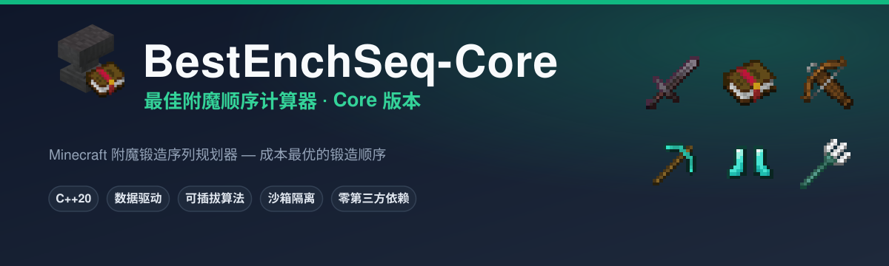
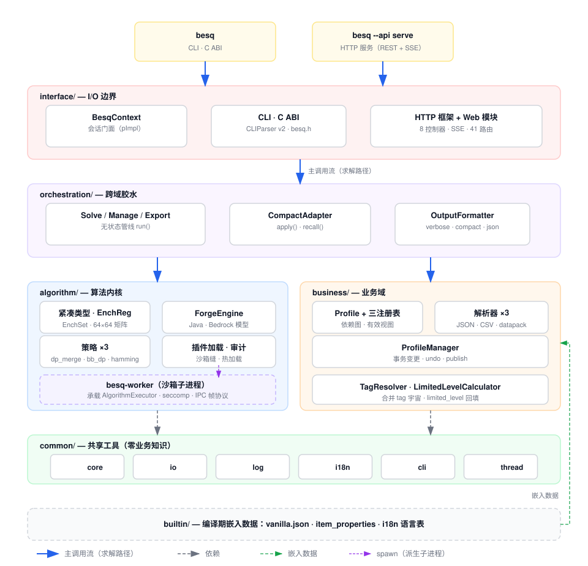

# BestEnchSeq-Core

[](https://en.cppreference.com/w/cpp/20)
[](LICENSE)
[](#从源码构建)

> **简体中文** | [English](README.en.md)

BestEnchSeq-Core 是 **BestEnchSeq 最佳附魔顺序计算器的 Core 版本**：给定期望的最终附魔（`--target`）与起点状态（`--source` 或库存物品），搜索**铁砧锻造成本最优**的附魔书锻造顺序，并输出逐步锻造方案。支持铁砧惩罚（prior work penalty）、魔咒冲突、装备适用性（tag）、Java/Bedrock 平台差异与 Too Expensive（39 级）上限等完整约束。

采用**数据驱动**架构：内置 vanilla 数据表，也支持自定义 JSON/CSV 数据、MC 官方 datapack 与 mod 魔咒；算法内核**可插拔**（内建 + 运行时插件热加载 + 审计/沙箱隔离）。纯标准库 C++20 实现，**零第三方依赖**（HTTP/JSON/i18n/并发组件全部自研）。

## 功能特性

- **最优锻造序列**：搜索成本最优的附魔书锻造顺序（精确 + 近似算法可选）
- **数据驱动**：vanilla JSON / CSV / MC 官方 datapack（`pack.mcmeta`）/ 自定义 mod 数据表
- **Profile 一等公民**：依赖图（拓扑解析 + 环检测）、有效视图合并、事务式变更（undo）、版本化发布（`--publish`）
- **可插拔算法**：内建 `dp_merge` / `bb_dp` / `hamming`；插件热加载 `astar` / `dfs` / `idastar` / `diff_first` / `penalty_balance`
- **沙箱隔离**（`BESQ_SANDBOX=1`）：第三方插件在 `besq-worker` 子进程中运行，父进程绝不 `dlopen`；ELF/PE 静态审计（W^X、危险符号）
- **异步执行**：暂停/恢复/取消 + 流式进度 + 二进制 checkpoint（断点续跑）
- **三种交互面**：CLI（`besq`）、C ABI（`include/besq/besq.h`）、本地 Web GUI（`besq-gui`，REST + SSE）
- **i18n**：内置 en_US / zh_CN，`--lang` > `BESQ_LANG` > 系统 locale 三级选择
- **C++ 核心零第三方依赖**：自研 HTTP 服务器、JSON DOM、日志、i18n、并发队列

## 快速开始

**要求**：C++20 编译器（Clang 18+ 或 MSVC）、CMake 3.25+、Ninja。项目无条件使用 C++20（concepts、`if constexpr`、`std::jthread`、原子 `wait`/`notify`），不支持 C++17 及更早版本。

### 从源码构建

```bash
# 配置 + 构建（Clang + Ninja；Windows 亦可用 MSVC）
cmake -S . -B build -G Ninja -DCMAKE_BUILD_TYPE=Release
cmake --build build

# 求解：--target 为期望最终状态，--source 为起点（已附魔的装备）
./build/bin/besq --target "diamond_sword[sharpness=5,knockback=2]" --source "sharpness=2"

# 目标已达成：--source ≥ --target 时输出 0 步方案（"目标已达成"）
./build/bin/besq --target "diamond_sword[sharpness=5]" --source "sharpness=5"

# 库存模式：--input 提供自包含 JSON 任务（target/items/algorithm/profile）
./build/bin/besq --input task.json
./build/bin/besq --input -   # 从 stdin 读取

# 其他语言输出 / JSON 输出
./build/bin/besq --lang en_US --target "diamond_sword[sharpness=5]" --source "sharpness=2"
./build/bin/besq --format json --target "diamond_sword[sharpness=5]" --source "sharpness=2"
```

### 外部算法插件

```bash
# 先构建宿主工程，再基于宿主构建树构建插件
# （编译器与构建类型必须与宿主完全一致，否则运行时加载失败）
cmake -S plugins -B build/plugins -DCMAKE_BUILD_TYPE=Release \
  -DCMAKE_C_COMPILER=clang -DCMAKE_CXX_COMPILER=clang++ \
  -DCMAKE_PREFIX_PATH=$PWD/build
cmake --build build/plugins

# 加载插件并列出全部可用算法
./build/bin/besq --algo-dir build/plugins --list-algorithms

# 使用插件算法（astar / dfs / idastar / diff_first / penalty_balance）
./build/bin/besq --algo-dir build/plugins --algorithm astar \
  --target "diamond_sword[sharpness=5,looting=3,unbreaking=3]" --source "sharpness=3"

# 沙箱模式：插件在 besq-worker 子进程中隔离执行
BESQ_SANDBOX=1 ./build/bin/besq --algo-dir build/plugins --algorithm astar \
  --target "diamond_sword[sharpness=5]" --source "sharpness=2"
```

### Profile / 数据

```bash
# 指定 profile（自动解析依赖；根 key 固定 builtin:vanilla）
./build/bin/besq --profile builtin:vanilla --target "diamond_sword[sharpness=5]" --source "sharpness=2"
./build/bin/besq --profile-dir data/tests/profiles --profile modded_sword \
  --target "diamond_sword[sharpness=5]" --source "sharpness=2"

# 发布 profile：拍平有效视图为自包含 JSON
./build/bin/besq --publish builtin:vanilla --publish-version 1.0 --publish-tag stable --output vanilla.json

# 管理 profile 数据（导入 / 编辑 / 导出）
./build/bin/besq --import mods/myenchant.json
./build/bin/besq --edit "ench:mod,sharpness,max_level=10"
./build/bin/besq --export out.json
```

完整的 CLI 选项见 `besq --help`（按分组渲染）。

## Web GUI（`besq-gui`）

面向玩家的本地 Web GUI，与 CLI 共享同一核心（REST API + SSE 事件流）。构建需开启 `BESQ_BUILD_GUI=ON`。

```bash
# 构建
cmake -S . -B build -G Ninja -DCMAKE_BUILD_TYPE=Release -DBESQ_BUILD_GUI=ON
cmake --build build --target besq-gui

# 运行（默认 127.0.0.1 + OS 自动分配端口；--browser 自动打开浏览器）
./build/bin/besq-gui --browser

# 开发模式：SPA 从磁盘热重载
BESQ_GUI_PORT=8765 ./build/bin/besq-gui --frontend-dir gui/frontend
```

| 控制器 | 端点（节选） |
|---|---|
| Health | `GET /health` |
| Status | `GET /api/status` |
| Settings | `GET/PATCH /api/settings`（持久化到 `config.json`） |
| Profiles | `/api/profiles` CRUD + activate/fork/merge/publish/rename + `{key}/enchantables/{item}` |
| Algorithm | `GET /api/algorithms[/{name}]`、`POST .../load\|unload` |
| Calculator | `POST /api/tasks`、`GET/DELETE /api/tasks/{id}`、`POST .../pause\|resume` |
| Fs | `GET /api/fs/list`（目录选择器） |
| History | `GET /api/history`（求解历史，`offset`/`limit`/`after_seq` 分页） |

SSE 事件流：`GET /api/tasks/{id}/events`（`progress` / `diag` / `completed` / `failed` 帧，15s 心跳）；静态资源挂载于 `/public`。

## 算法策略

| 策略 | 类型 | 最优性 | 规模 | 来源 | 机制 |
|---|---|---|---|---|---|
| `dp_merge` | 精确 | 是 | ≤ 20 | 内建（direct 模式默认） | 递归划分 DP + (EnchSet, PPN) Pareto 桶；支持 checkpoint 恢复 |
| `bb_dp` | 精确 | 是 | ≤ 24 | 内建 | 分支定界 + 逐层自底向上 DP，惰性 StepTree |
| `hamming` | 近似 | 否 | 大 | 内建（inventory 模式默认） | Popcount 均衡合并树，O(n log n) |
| `astar` | 精确 | 是 | ≤ 9 | 插件 | 可采纳启发式 + 优先队列 |
| `dfs` | 精确 | 是 | ≤ 8 | 插件 | 分支定界 + 哈希记忆化 |
| `idastar` | 精确 | 是 | ≤ 10 | 插件 | 迭代加深 + 置换表 |
| `diff_first` | 近似 | 否 | 任意 | 插件 | PPN 层内最便宜对 |
| `penalty_balance` | 近似 | 否 | 任意 | 插件 | 合并最接近惩罚对 |

新算法只需实现 `IAlgorithm::execute()` 即可获得线程管理、暂停/取消与进度上报。

## 架构

四域单向分层 + 共享工具层，三个构建产物（`besq` / `besq-gui` / `besq-worker`）共享同一核心：



```
CLI / GUI → BesqContext（会话门面）
  → 编排管线（Solve / Manage / Export）
  → CompactAdapter::apply()（业务 → 紧凑类型，裁剪 EnchReg）
  → IExecutor（AlgorithmExecutor | SandboxedExecutor）→ IAlgorithm
  → CompactAdapter::recall()（还原 ID + 构建方案）→ OutputFormatter
```

关键设计：

- **双层类型系统**：业务域胖对象（NSID 字符串键）↔ 算法域紧凑值类型（`Ench` 2B / `EnchSet` 88B / 64×64 位冲突矩阵 O(1)），由 `CompactAdapter` 唯一桥接
- **沙箱缝在 executor 之上**：插件经 `loader.create_executor(name)` 拿到的仍是 `IExecutor`，跨进程暂停/checkpoint 语义与进程内一致
- **Profile 一等公民**：管线只收 `Profile`/`ProfileManager`，绝不传裸注册表；适用性 = `supported_items ∩ tags_of(item)`
- **无状态管线**：`struct XxxPipeline { static run(...) }`，无注册无虚分派
- **共享内核**：`besq-algo-core`（SHARED）是 CLI / worker / 插件三方唯一进程内副本，保证 vtable 与堆分配器唯一

目录与各域详细设计见 [docs/architecture-overview.md](docs/architecture-overview.md)。

## 插件与沙箱

- **插件协议**：单 C 符号 `besq_create_algorithm`，共享 vtable/堆，无需 destroy；加载前静态审计（W^X、危险导入）
- **插件构建**：`plugins/` 独立 CMake 工程，链接宿主导出的 `besq-algo-core::besq-algo-core`；构建类型必须与宿主一致（不匹配会链接失败）
- **沙箱**：`BESQ_SANDBOX=1` 时插件**永不 dlopen**——`SandboxedExecutor` 派生 `besq-worker` 子进程承载真执行器，父进程侧走帧协议（`MsgRun`/`Pause`/`SerializeState`，checkpoint 为不透明分块 blob）；Linux 下 seccomp 限制文件/网络/进程 syscall
- **审计夹具**：`plugins/malicious` 为故意不安全的插件，用于验证审计/沙箱拒绝路径

## 配置

| 环境变量 | 说明 |
|---|---|
| `BESQ_LANG` | 界面语言（en_US / zh_CN），`--lang` 优先 |
| `BESQ_SANDBOX=1` | 插件沙箱隔离（`besq-worker` 子进程） |
| `BESQ_WORKER_PATH` | 覆盖 worker 路径（默认 `<exe_dir>/besq-worker[.exe]`，再查 PATH） |
| `BESQ_GUI_HOST` | GUI 监听地址（默认 `127.0.0.1`） |
| `BESQ_GUI_PORT` | GUI 端口（默认 `0` = OS 自动分配） |
| `BESQ_GUI_OPEN_BROWSER` | 启动时自动打开浏览器 |
| `BESQ_GUI_WORKERS` | HTTP 消费线程数（默认 2） |
| `BESQ_GUI_RES_DIR` | `/public` 磁盘兜底根（开发热重载） |

## 测试与基准

```bash
# 全部测试
ctest --test-dir build --output-on-failure

# 单个测试目标
cmake --build build --target test_domain_types && ./build/bin/test_domain_types

# 基准（harness v2：二维表 + 分组/吞吐/对比）
cmake --build build --target forge_benchmark
./build/bin/forge_benchmark --group sword --algo dp_merge,bb_dp
./build/bin/forge_benchmark --json    # 机器可读 JSON 汇总（供 scripts/bench_report.py）
./build/bin/forge_benchmark --list    # 列出全部用例
```

- 测试框架 `tests/framework/test_framework.h`：`TEST_CASE` 自动注册 + 共享 main + per-case 超时 + `SKIP`；参数 `--list` / `--filter` / `--repeat` / `--verbose`
- 组织：common / domain（algorithm、business、interface、orchestration）/ integration（真实 socket e2e）/ system（真实 CLI 二进制）
- 插件相关用例（plugin audit、sandbox）在插件树 + worker 缺失时自动 SKIP

## 脚本

| 脚本 | 用途 |
|---|---|
| `scripts/evaluate.sh` | WSL 评估：Valgrind 泄漏检测、Callgrind/Massif/CacheGrind 分析、benchmark |
| `scripts/bench_report.py` | benchmark 结果解析 + 趋势图 |
| `scripts/get_vanilla_data.py` / `download_mc_lang.py` | 从 MC 客户端 jar 提取魔咒/装备数据与官方语言表（`scripts/vanilla/` 包） |
| `scripts/gen_frontend_icons.py` | 从 vanilla 材质包生成物品图标源（`assets/item_icons/`） |
| `scripts/gen_sprite.py` | 聚合图标源 → sprite sheet + 前端索引（`gui/frontend/vendor/icons/sprite.png`） |
| `scripts/gen_names_zh.py` | 生成前端中文名映射（`gui/frontend/names_zh.js`） |
| `scripts/gen_modded_profile.py` | 生成基准测试 mod profile（`data/tests/profiles/modded_sword.json`） |
| `scripts/parse_callgrind.py` / `parse_massif.py` / `parse_cachegrind.py` | 分析输出解析 |

## 文档导航

| 文档 | 内容 |
|---|---|
| [docs/architecture-overview.md](docs/architecture-overview.md) | 架构总览（新开发者入口） |
| [docs/project-design.md](docs/project-design.md) | 设计理念详述 |
| [docs/软件需求规格说明书.md](docs/软件需求规格说明书.md) | 需求规格（SRS） |
| [docs/json-output-schema.md](docs/json-output-schema.md) | JSON 输出线格式规范 |
| [docs/domain_designs/](docs/domain_designs/) | 各域详细设计（business / interface / orchestration / plugin-sandbox） |
| [docs/mc/anvil-mechanics-reference.md](docs/mc/anvil-mechanics-reference.md) | Minecraft 铁砧机制参考 |

## 贡献

欢迎提交 [Issue](https://github.com/Dinosaur-MC/BestEnchSeq-Core/issues)（Bug 报告 / 功能请求请使用对应的[模板](.github/ISSUE_TEMPLATE/)）与 Pull Request。

新开发者建议从 [docs/architecture-overview.md](docs/architecture-overview.md) 的「给新开发者的第一课」开始。

## 许可

[MIT](LICENSE) © 2026 Dinosaur_MC
