# BestEnchSeq-Core

## Overview

A C++20 tool (CLI: `besq`) to calculate the best enchanting order for your enchantments and enchanted books, which will try reducing your enchanting cost on anvil as far as possible. It not only supports enchantments in Vanilla Minecraft, but also those in various mods, as it uses extensible enchantment sheets and a data-driven registry system to maintain enchantment information and can easily add third-party/custom enchantments.

### Key Features

- [x] Calculate the best enchanting order/forging sequence by your given needs
- [x] Support inventory management, providing well handling of complex enchanted items/situations (applicability, upgrade, confliction, override, prior work penalty, durability, etc.)
- [x] Support third-party/custom enchantments by editing custom enchantment sheet
- [x] Support third-party/custom equipments by editing custom equipment sheet
- [x] Pluggable algorithm strategies: hamming, dfs, astar, dp_merge, plus external plugins
- [x] Asynchronous execution with pause/resume/cancel and streaming progress
- [x] Moddable forge engine via IForgeEngine virtual interface
- [x] Profile-based data management with versioning, branching, merging
- [x] Profile dependencies (transitive resolution + cycle detection), effective view, versioned publish (`--publish`)
- [x] Multi-format data loading: vanilla JSON, CSV, MC data-driven format, and datapack (`pack.mcmeta`) as profiles
- [x] String-keyed profile identity (`--profile <key>`, root `builtin:vanilla`) — NSID reserved for MC content ids
- [x] Built-in + plugin algorithm strategies
- [x] Binary checkpointing for long-running searches
- [x] Input validation + EnchReg pruning via CompactAdapter::apply()
- [ ] Optionally hosting a RESTful API service for external applications

### Quick Start

**Requirements:** C++20 toolchain (Clang 15+), CMake 3.20+, Ninja.
The project uses C++20 features unconditionally — concepts, `if constexpr`,
`std::jthread`, atomic `wait`/`notify`, etc. No feature-test macros or
fallbacks. C++17 or earlier is not supported.

#### From source code

```bash
cmake -S . -B build
cmake --build build
# --target 必须携带 `[附魔]`（期望最终状态），--source 为装备当前已有魔咒（起点状态）
besq --target "diamond_sword[sharpness=5]" --source "sharpness=2"
besq --algo-dir build/plugins --algorithm astar --target "diamond_sword[sharpness=5,looting=3,unbreaking=3]" --source "sharpness=3"
besq --algorithm penalty_balance --target "diamond_chestplate[protection=4,thorns=3,unbreaking=3,mending=1]"
besq --algorithm hamming --target "netherite_sword[sharpness=5,sweeping_edge=3,looting=3,unbreaking=3,fire_aspect=2,knockback=2,mending=1,vanishing_curse=1]"

# 目标已达成：--source 已 ≥ --target 时输出 0 步方案（"目标已达成"）
besq --target "diamond_sword[sharpness=5]" --source "sharpness=5"

# Profile / datapack / publish
besq --profile builtin:vanilla --target "diamond_sword[sharpness=5]" --source "sharpness=2"
besq --profile-dir data/tests/profiles --profile modded_sword --target "diamond_sword[sharpness=5]" --source "sharpness=2"
besq --publish builtin:vanilla --publish-version 1.0 --publish-tag stable --output out/vanilla.json
```

Alternatively, invoke directly from the build directory:

```bash
./build/bin/besq --target "diamond_sword[sharpness=5]" --source "sharpness=2"
```

### Running tests

```bash
cd build && ctest --output-on-failure
```

### Benchmark

```bash
./build/bin/forge_benchmark --group sword --algo greedy,dfs
./build/bin/forge_benchmark --list
./build/bin/forge_benchmark --help
```

## Web GUI (`besq-gui`)

Player-facing local Web GUI over the same core. v1 host: the default browser
(`--browser` / `BESQ_GUI_OPEN_BROWSER=1`); a native WebView2 window is future
work (the Microsoft WebView2 SDK is not vendored).

```bash
# Build
cmake -S . -B build -G Ninja -DCMAKE_BUILD_TYPE=Release -DBESQ_BUILD_GUI=ON
cmake --build build --target besq-gui

# Run (dev mode, hot-reload SPA from disk)
BESQ_GUI_PORT=8765 ./build/bin/besq-gui --browser --frontend-dir gui/frontend

# Run (production single-exe, embedded SPA)
./build/bin/besq-gui
```

Environment: `BESQ_GUI_HOST` (default `127.0.0.1`), `BESQ_GUI_PORT` (default
`0` = OS-assigned), `BESQ_GUI_OPEN_BROWSER`, `BESQ_LANG`.
Endpoints: `/health`, `/api/settings`, `/api/profile[...]`, `/api/algorithm`,
`/api/calculator`, `/api/logs`, `/api/status`.

## Architecture

The project uses a **four-domain architecture** built on shared utilities.

```
CLI → CLIApp (application runner)
  → BesqContext (session facade, pImpl)
  → Orchestration Pipeline (SolvePipeline / ManagePipeline / ExportPipeline)
  → CompactAdapter::apply() (validates + prunes EnchReg + converts)
  → AlgorithmInput (compact) → AlgorithmExecutor → IAlgorithm
  → AlgorithmOutput (compact steps + final_item)
  → CompactAdapter::recall() (restores IDs + builds solutions, passes final_item)
  → OutputFormatter (domain)
```

### Domain Overview

| Domain | Namespace | Purpose | Dependencies |
|--------|-----------|---------|-------------|
| `algorithm/` | `algorithm::` | Algorithm execution: compact types, forge engine, strategies, diagnostics | `common-core` + log |
| `business/` | `::` | Business types, registries, Profile, parsers, loaders, ProfileManager, components (RegistryHelper) | `common-core` + io + log |
| `orchestration/` | `orchestration::` | Cross-domain wiring: pipelines, CompactAdapter, formatters | algorithm + business |
| `interface/` | `::` | I/O boundary: CLIApp, BesqContext, C ABI | orchestration + common sub-targets |

### Source Layout

```mermaid
flowchart TB
    %% ── Style definitions ──
    classDef common fill:#e8f5e9,stroke:#2e7d32,stroke-width:1.5px
    classDef algo   fill:#e3f2fd,stroke:#1565c0,stroke-width:1.5px
    classDef biz    fill:#fff3e0,stroke:#e65100,stroke-width:1.5px
    classDef orch   fill:#f3e5f5,stroke:#6a1b9a,stroke-width:1.5px
    classDef iface  fill:#fce4ec,stroke:#c62828,stroke-width:1.5px
    classDef data   fill:#f5f5f5,stroke:#9e9e9e,stroke-width:1px,stroke-dasharray:4 3
    classDef entry  fill:#fff9c4,stroke:#f57f17,stroke-width:2px
    classDef legend fill:#ffffff,stroke:#cccccc,stroke-width:1px

    %% ── Entry point ──
    Entry["main.cpp / CLI"]:::entry
    AppConfig["AppConfig.h<br/>BuildConfig.h.in"]:::data

    %% ── Data sources ──
    subgraph Data[" "]
        Vanilla["data/builtin/*.json<br/>Vanilla + item properties"]
        I18nData["data/i18n/*.json<br/>Translations (zh_CN, en_US)"]
        ExtSheets["External JSON / CSV<br/>Custom registry sheets"]
        Plugins["Plugins .so/.dll<br/>External algorithms"]
    end
    style Data fill:#fafafa,stroke:#bdbdbd,stroke-dasharray:6 3

    %% ── Common layer ──
    subgraph Common["common/ — Shared Libraries"]
        direction TB
        CT["CommonTypes.h<br/>NSID / MCE / AlgorithmMode"]
        IO["io/<br/>JSON DOM / CsvIO / ByteStream"]
        I18n["i18n/<br/>Language / LocaleDetector"]
        Log["log/<br/>Async Logger"]
        Ser["serialization/<br/>ISerializable interfaces"]
        Utils["utils/<br/>CLIParser / Queues / MemoryPool / EventLoop"]
    end
    style Common fill:#f1f8e9,stroke:#558b2f

    %% ── Algorithm domain ──
    subgraph Algorithm["domain/algorithm/ — Algorithm Domain"]
        direction TB
        AlgoInput["AlgorithmInput / AlgorithmOutput<br/>EnchReg / compact types"]
        Executor["AlgorithmExecutor / ExecutionContext"]
        Strategies["_strategies/<br/>A* / DFS / DP Merge / Hamming"]
        Forge["forge_engine/<br/>IForgeEngine / ForgeEngine"]
        Plugin["plugin/<br/>AlgorithmLoader"]
        Diag["diagnostics/<br/>IAlgorithmObserver"]
        Check["serialization/<br/>Binary Checkpoint"]
    end
    style Algorithm fill:#e3f2fd,stroke:#1565c0

    %% ── Business domain ──
    subgraph Business["domain/business/ — Business Domain"]
        direction TB
        Profile["Profile<br/>EnchantmentRegistry / EquipmentRegistry<br/>TagRegistry"]
        Types["types/<br/>Ench / EnchInfo / Item / Solution / DTOs"]
        Registries["registries/<br/>IRegistry / EnchantmentRegistry<br/>EquipmentRegistry / TagRegistry"]
        Parsers["parsers/<br/>NativeJsonParser / NativeCsvParser<br/>McOfficialParser"]
        Loaders["loaders/<br/>RegistryLoader / ProfileLoader"]
        PM["ProfileManager<br/>dependencies / effective view<br/>publish / datapack"]
        Comp["components/<br/>RegistryHelper / FormatDetector<br/>Serializer / TagResolver"]
    end
    style Business fill:#fff3e0,stroke:#e65100

    %% ── Orchestration domain ──
    subgraph Orchestration["domain/orchestration/ — Orchestration Domain"]
        direction TB
        Pipelines["pipelines/<br/>SolvePipeline / ManagePipeline / ExportPipeline"]
        Adapter["components/<br/>CompactAdapter (apply / recall)"]
        Formatter["components/<br/>OutputFormatter (verbose / compact / json)"]
        EnchSer["components/<br/>EnchSerializer (JSON / CSV export)"]
        Contracts["types/<br/>SolveRequest / SolveResult<br/>ManageRequest / ExportRequest"]
    end
    style Orchestration fill:#f3e5f5,stroke:#6a1b9a

    %% ── Interface domain ──
    subgraph Interface["domain/interface/ — Interface Domain"]
        direction TB
        Ctx["BesqContext.h/.cpp<br/>Session Facade (pImpl)"]
        CLI["cli/<br/>CLIApp / EnchParser / ItemParser"]
        ABI["abi/<br/>C ABI (besq.h)"]
    end
    style Interface fill:#fce4ec,stroke:#c62828

    %% ── Tests & Benchmarks ──
    Tests["tests/<br/>Standalone test executables"]:::data
    Bench["benchmarks/<br/>Performance benchmarks"]:::data

    %% ── Data flow arrows ──
    Entry --> CLI
    CLI --> Ctx
    Ctx --> Pipelines
    Pipelines --> Adapter
    Adapter --> AlgoInput
    AlgoInput --> Executor
    Executor --> Strategies & Plugin
    Executor --> Forge
    Strategies --> Diag
    AlgoInput -.-> Check

    %% Business ← Data
    ExtSheets -.-> Parsers
    Vanilla -.-> Loaders
    I18nData -.-> I18n

    %% Orchestration ← Business
    Adapter --> Profile
    Pipelines -.-> Contracts
    Pipelines --> Profile
    Formatter --> Profile
    EnchSer --> Profile
    Profile --> Types & Registries
    Loaders --> Registries
    PM --> Profile

    %% Common → all domains
    Algorithm -.-> Common
    Business -.-> Common
    Orchestration -.-> Common
    Interface -.-> Common

    %% Plugin loading
    Plugin -.-> Plugins

    %% Tests & Benchmarks
    Tests -.-> Profiles & Pipelines
    Bench -.-> Executor

    %% ── Legend ──
    subgraph Legend[" "]
        L1["main.cpp / Entry"]:::entry
        L2["Data / Config / Metadata"]:::data
    end
    style Legend fill:#ffffff,stroke:#cccccc,stroke-width:1px
```



Directory layout mirrors the domain structure above:

```
src/                          tests/                        benchmarks/
├── main.cpp                   ├── common/                    └── forge_benchmark
├── builtin/                   ├── domain/
├── common/                    │   ├── algorithm/
├── domain/                    │   ├── business/
│   ├── algorithm/             │   ├── orchestration/
│   ├── business/              │   └── interface/
│   ├── orchestration/         └── integration/
│   └── interface/
├── data/
└── include/
    └── besq/besq.h
```

### Algorithm Strategies

| Strategy | Type | Optimality | Scale | Origin | Mechanism |
|----------|------|-----------|-------|--------|-----------|
| DP Merge | Approx | No | Large | Built-in (src/) | Dynamic programming merge (default) |
| Hamming | Approx | No | Large | Built-in (src/) | Popcount-balanced binary merge tree |
| DFS | Exact | Yes | ≤ 8 | Built-in (src/) | B&B + hash memoization |
| A* | Exact | Yes | ≤ 9 | Built-in (src/) | Admissible heuristic + priority queue |
| Greedy | Approx | No | Any | Plugin (plugins/) | Cost-sorted greedy merge |
| Penalty Balance | Approx | No | Any | Plugin (plugins/) | Merge closest penalty pairs |
| Hierarchical | Approx | No | Large | Plugin (plugins/) | Hierarchical group-then-merge |
| DiffFirst | Approx | No | Any | Plugin (plugins/) | PPN-layer, cheapest pair per layer |
| IDA* | Exact | Yes | ≤ 10 | Plugin (plugins/) | Iterative deepening + TT pruning |

All algorithms share `IForgeEngine` and compact types. New algorithms only need to implement `IAlgorithm::execute()` to gain thread management, pause/cancel, and progress reporting.

### Profile Management

`ProfileManager` (business-domain entry) manages profiles whose keys are **plain strings** (arbitrary readable names, spaces and dots kept verbatim; NSID is reserved for MC content ids). The root key is fixed at `builtin:vanilla`.

- **Dependencies**: `ProfileMetadata.dependencies` (string list) is resolved transitively in topological order with cycle detection (`resolve_dependencies`).
- **Effective view**: `resolve_effective` topologically merges the dependency chain + the profile itself (upper layers win), builds a merged-tag `TagResolver`, and caches the result.
- **Stable CRUD**: real-time validation + automatic snapshot; `undo()` rolls back the last successful change.
- **Publish**: `--publish <key> [--publish-version <v> --publish-tag <t>]` flattens the effective view into a self-contained profile JSON (with embedded `version` / `release_tag`).
- **Datapack**: directories with `pack.mcmeta` load as one profile via the real MC 1.21+ format (single-string/array `supported_items`, `slots`, `tag replace`, `anvil_cost`). A datapack's multiple namespaces (`data/<ns1>/`, `data/<ns2>/`, including `data/minecraft/` overriding vanilla) aggregate into that profile; the profile key is `pack.id` or the folder name verbatim.
- **Discovery**: `<cwd>/profiles/` is scanned by default (`--profile-dir <dir>` overrides); `--profile <key>` activates any string key.

### Key Design Decisions

**Compact types (`algorithm::`)**: `algorithm::Enchantment` (4 bytes: int16_t id + level), `algorithm::EnchSet` (sorted vector, O(log N) lookup), `algorithm::Item` (type + dur + ppn + enchs). No pointer indirection, no virtual dispatch, zero domain dependencies.

**Flat conflict matrix**: `algorithm::EnchReg` stores an N×N `vector<char>` for O(1) incompatibility checks — single allocation, contiguous memory.

**EnchReg pruning**: `CompactAdapter::apply()` builds a subset of the global registry that only includes enchantments applicable to the target equipment. Smaller conflict matrix, faster lookups.

**IForgeEngine virtual interface**: All forge sub-operations have default vanilla implementations. Subclass only what you need for modded rules. `ForgeEngine` overrides to respect `ForgeConfig` flags.

**AlgorithmInput owns data**: `algorithm::EnchReg`, `algorithm::Item` vector, and target collection are stored by value — no pointers, no external lifetime dependencies. The struct owns two config sub-objects: `f_config` (forge config, `ForgeConfig`) and `s_config` (search config, `SearchConfig`).

**Profile as first-class citizen**: All pipelines receive `Profile` (or `ProfileManager`), never raw registries extracted from Profile. `Profile` owns `EnchantmentRegistry`, `EquipmentRegistry`, and `TagRegistry` as a unit. Enchantment applicability is `supported_items ∩ tags_of(item)` (real-MC item tags), resolved via the profile's attached `TagResolver`.

**Pipeline pattern**: Every pipeline is a standalone struct with a single `run()` method. No polymorphism, no registration — dispatch by switch at `BesqContext` or `main.cpp`.

**Serialization interfaces**: Business types implement `IJsonSerializable` (`to_json()` / `from_json()`). ADL-compatible free functions in `Serializer.h` delegate to member implementations.

**Four-domain layering**: `algorithm/` depends only on `besq-common-core` + log. `business/` adds domain types and registries (depends on core + io + log). `orchestration/` wires algorithm + business together. `interface/` adds CLIApp, BesqContext, C ABI (depends on orchestration + common sub-targets). `besq-common/` is split into 5 independent static libraries (core, io, log, i18n, cli) — targets link only what they need.

**No global platform singleton**: Platform (`MCE::Java` / `MCE::Bedrock`) flows through `ForgeConfig` → `AlgorithmInput` → `IForgeEngine`. No global mutable state.

**CLIParser with help grouping**: Option/Flag structs carry an optional ``help_group`` field. ``format_help()`` renders options under ``--- Group Name ---`` headers. Duplicate option detection emits warnings for repeated non-flag options. All parser errors are localized via ``UserI18nTranslator``.

**final_item**: ``AlgorithmOutput::final_item`` is computed by ``AlgorithmExecutor::output()`` as the target equipment with all source enchantments merged, flowing through ``CompactAdapter::recall()`` into ``Solution::final_item``. ``format_verbose()`` displays it at the end of the forge plan.

**Language selection**: ``CLIApp::apply_lang()`` is called early in ``main.cpp`` (before parsing) so ``--lang`` affects error messages and help text. Invalid ``--lang`` values print a warning listing available languages (``en_US``, ``zh_CN``) and fall back to the system locale. Uses ``EnvUtil`` (not raw ``getenv``) for type-safe env var access.


## Scripts

| Script | Purpose |
|--------|---------|
| `scripts/evaluate.sh` | WSL-based Valgrind evaluation — leak check, Callgrind/Massif profiling, benchmark |
| `scripts/get_vanilla_data.py` | Extract enchantment/equipment data from official Minecraft client jar → `data/builtin/vanilla.json` |
| `scripts/parse_callgrind.py` | Parse Callgrind `callgrind.out` → function hotspot ranking |
| `scripts/parse_massif.py` | Parse Massif `ms_print` output → heap memory change chart + allocation hotspots |

## License

> MIT License
